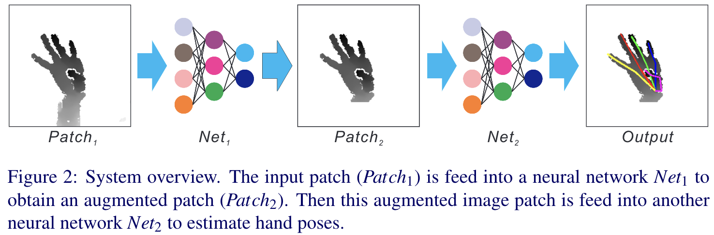
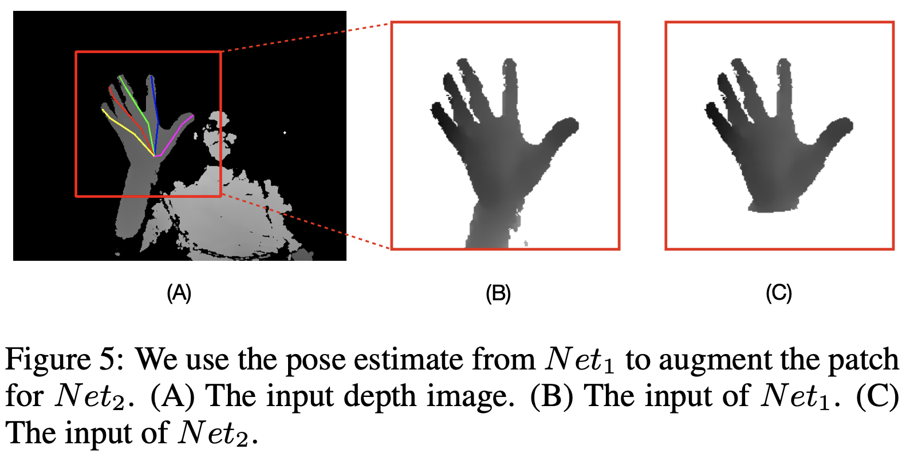
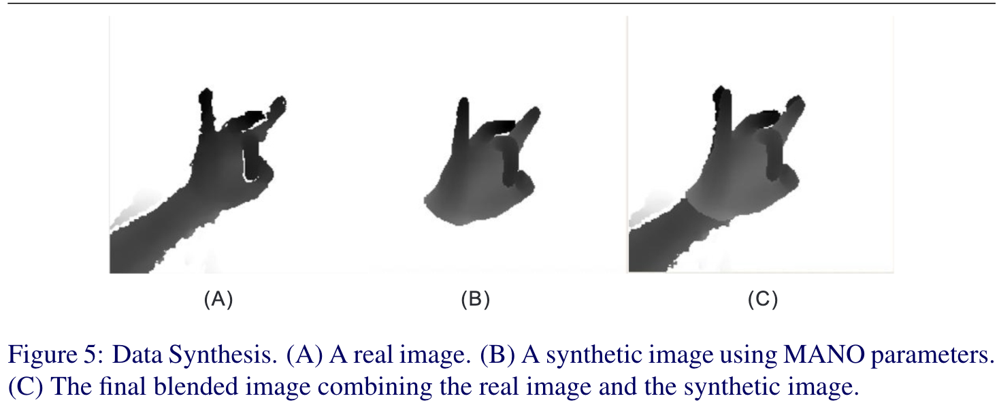
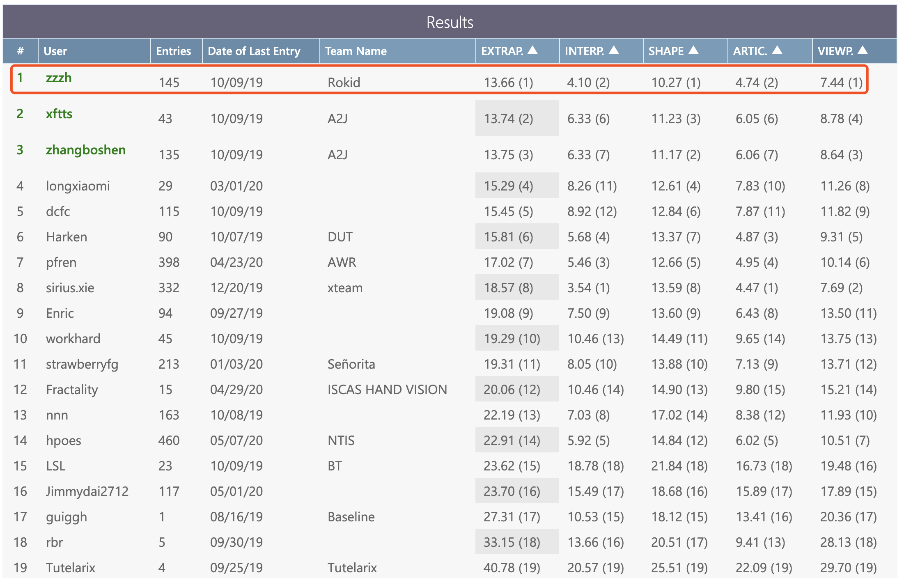
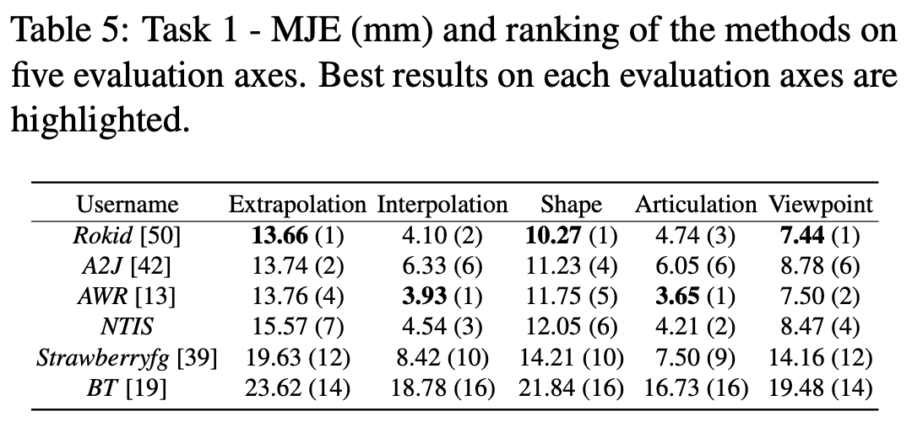
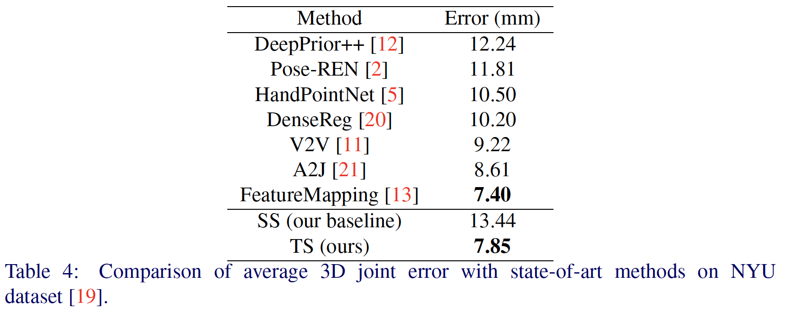

# HandAugment
The winner method of [HANDS19 Challenge: Task 1 - Depth-Based 3D Hand Pose Estimation](https://sites.google.com/view/hands2019/challenge#h.p_Y9eLuCuXYN7U)

The code for paper: "HandAugment: A Simple Data Augmentation Method for Depth-Based 3D Hand Pose Estimation"

https://arxiv.org/abs/2001.00702


## The code will be released soon (before 2020-May-20)!


## HandAugment Architecture








## Quantitative Comparison
### HANDS19 Task1 Dataset




###NYU Dataset



## Citation
```
@article{zhang2020handaugment,
  title={HandAugment: A Simple Data Augmentation Method for Depth-Based 3D Hand Pose Estimation},
  author={Zhang, Zhaohui and Xie, Shipeng and Chen, Mingxiu and Zhu, Haichao},
  journal={arXiv},
  pages={arXiv--2001},
  year={2020}
}
```